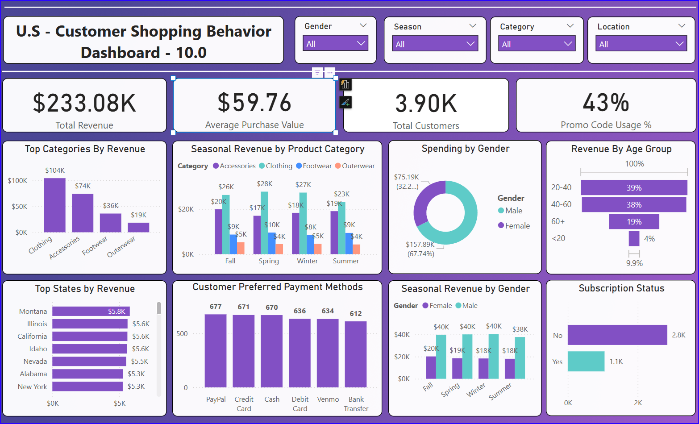
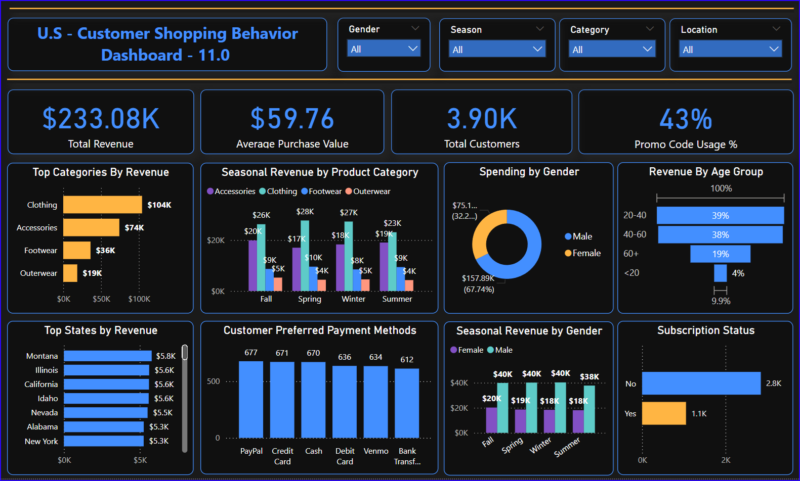

# US Customer Shopping Behavior Dashboard

## 📊 Dashboard Project Findings 
“US Customer Shopping Behavior dashboard shows: $233.1K total revenue, $59.76 average order value, and 43% promo-code usage.” 
  
## Key insights:  
• 🔍 Top category: Clothing $104K (45% of sales)  
• 🌸 Best season: Spring - with $68K across all categories  
• 📉 Low-performing states:  
	– Kansas $3.4K  
	– Florida & Hawaii $3.8K each  
• 💳 Payment mix: PayPal 677 orders vs. Credit Card 671  
• 👥 Gender split: 68% male spend vs. 32% female  
• 🎂 Age groups: 20–40 year-olds make 39% of revenue; under-20s only 4%  
• 🔄 Subscriptions: Only 28% of customers subscribe   

## Recommendations:  
• Run targeted promos in Kansas, Florida & Hawaii  
• Push outerwear in Summer (currently only $5K)  
• Design campaigns for female shoppers  
• Create youth-focused offers to boost under-20 engagement  
• Increase subscription sign-ups with a welcome discount

# Light Mode

# Dark Mode

